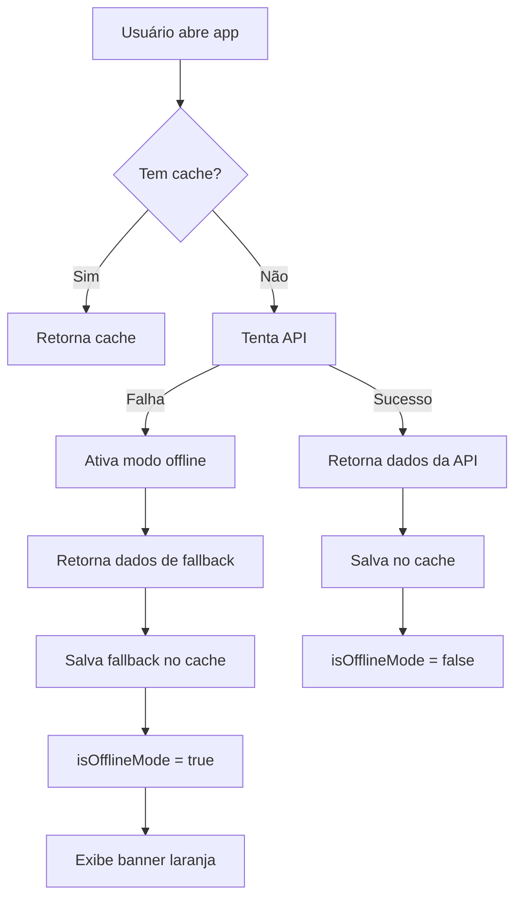

# Sistema de Fallback Offline

## 📋 Visão Geral

Sistema de fallback implementado para garantir uma melhor experiência ao usuário
quando a API do Node-RED estiver offline ou inacessível.

## 🎯 Funcionalidades

### 1. Detecção Automática de Falha

- Quando a API não responde, o sistema automaticamente ativa o modo offline
- Não há necessidade de configuração manual
- Totalmente transparente para o usuário

### 2. Dados de Exemplo

Quando offline, o app exibe 8 medicamentos de exemplo:

- Paracetamol (500mg)
- Ibuprofeno (400mg)
- Omeprazol (20mg)
- Dipirona (500mg)
- Losartana (50mg)
- Loratadina (10mg)
- Vitamina D3 (2000 UI)
- Xarope Expectorante (10ml)

### 3. Indicador Visual

Banner laranja exibido no topo das telas quando em modo offline:

- 🔴 **HomeScreen**: Banner com ícone de nuvem offline
- 🔴 **MedicationListScreen**: Banner com mensagem clara
- Cor: Âmbar (#F59E0B) para chamar atenção sem alarmar

## 🏗️ Arquitetura

### Arquivos Modificados/Criados

#### 1. `fallbackData.ts` (Novo)

```typescript
// Dados de exemplo para modo offline
export const FALLBACK_MEDICATIONS: Medication[];
export function getFallbackMedications(): Medication[];
```

#### 2. `ApiMedicationRepository.ts` (Modificado)

```typescript
class ApiMedicationRepository {
  private _isOfflineMode: boolean;

  async getAll(): Promise<Medication[]> {
    // 1. Tenta buscar do cache
    // 2. Se não tem cache, tenta API
    // 3. Se API falhar, usa fallback
    // 4. Sempre retorna dados (nunca vazio)
  }
}
```

#### 3. `useMedications.ts` (Modificado)

```typescript
export function useMedications() {
  const [isOfflineMode, setIsOfflineMode] = useState(false);

  return {
    medications,
    loading,
    error,
    isOfflineMode, // ✨ Novo
    // ... rest
  };
}
```

#### 4. Telas Atualizadas

- `HomeScreen.tsx`: Banner de modo offline
- `MedicationListScreen.tsx`: Banner de modo offline

## 🔄 Fluxo de Funcionamento



## 💡 Benefícios

### Para o Usuário

✅ **Nunca vê tela vazia** - Sempre há dados para explorar ✅ **Feedback
claro** - Banner indica claramente modo offline ✅ **Sem crashes** - App
continua funcional mesmo sem API ✅ **Experiência consistente** - Layout e
navegação funcionam normalmente

### Para o Desenvolvedor

✅ **Desenvolvimento facilitado** - Pode trabalhar sem API rodando ✅
**Demonstrações** - Sempre tem dados para apresentar ✅ **Testes** - Fácil
testar UI sem depender de backend

## 🔧 Configuração

Não há configuração necessária! O sistema funciona automaticamente.

### Como Testar

1. **Desligar Node-RED:**

   ```bash
   docker-compose down
   ```

2. **Abrir o app:**
   - Verá o banner laranja "Modo Offline - Dados de Exemplo"
   - 8 medicamentos de exemplo aparecerão
   - Todas as funcionalidades de visualização funcionam

3. **Reativar API:**

   ```bash
   docker-compose up -d
   ```

   - Puxe para atualizar (pull-to-refresh)
   - Banner desaparece automaticamente
   - Dados reais são carregados

## ⚠️ Limitações do Modo Offline

Quando em modo offline:

- ❌ Não é possível **adicionar** novos medicamentos
- ❌ Não é possível **editar** medicamentos existentes
- ❌ Não é possível **excluir** medicamentos
- ✅ **Visualização** funciona perfeitamente
- ✅ **Navegação** funciona normalmente
- ✅ **Busca local** nos dados de exemplo funciona

> 💡 **Dica**: Para operações de escrita (criar/editar/deletar), o usuário
> precisa estar online. O app mostrará um erro amigável caso tente fazer essas
> operações offline.

## 🎨 Personalização

### Modificar Dados de Fallback

Edite: `/src/features/medication/repository/fallbackData.ts`

```typescript
export const FALLBACK_MEDICATIONS: Medication[] = [
  {
    id: 'fallback-1',
    name: 'Seu Medicamento',
    dosage: '100',
    // ... adicione seus dados
  },
  // ... mais medicamentos
];
```

### Modificar Aparência do Banner

Edite as telas (`HomeScreen.tsx` ou `MedicationListScreen.tsx`):

```tsx
{
  isOfflineMode && (
    <View className='bg-amber-500 px-4 py-2'>
      {' '}
      {/* Mude a cor aqui */}
      <MaterialIcons name='cloud-off' size={20} color='white' />
      <Text className='text-white font-semibold ml-2'>
        Sua Mensagem Personalizada {/* Mude o texto aqui */}
      </Text>
    </View>
  );
}
```

## 🚀 Próximos Passos (Futuras Melhorias)

1. **Queue de Operações**: Salvar operações offline e sincronizar quando voltar
   online
2. **Persistência**: Salvar últimos dados da API em AsyncStorage
3. **Sincronização Inteligente**: Detectar quando API volta e sincronizar
   automaticamente
4. **Modo Apenas Cache**: Permitir usar app completamente offline com dados
   previamente carregados

## 📝 Notas Técnicas

- **Cache**: 5 minutos de TTL (Time To Live)
- **Fallback**: Retorna cópia dos dados (imutável)
- **Estado**: `isOfflineMode` é reativo e atualiza UI automaticamente
- **Performance**: Zero impacto - fallback só é usado quando necessário
